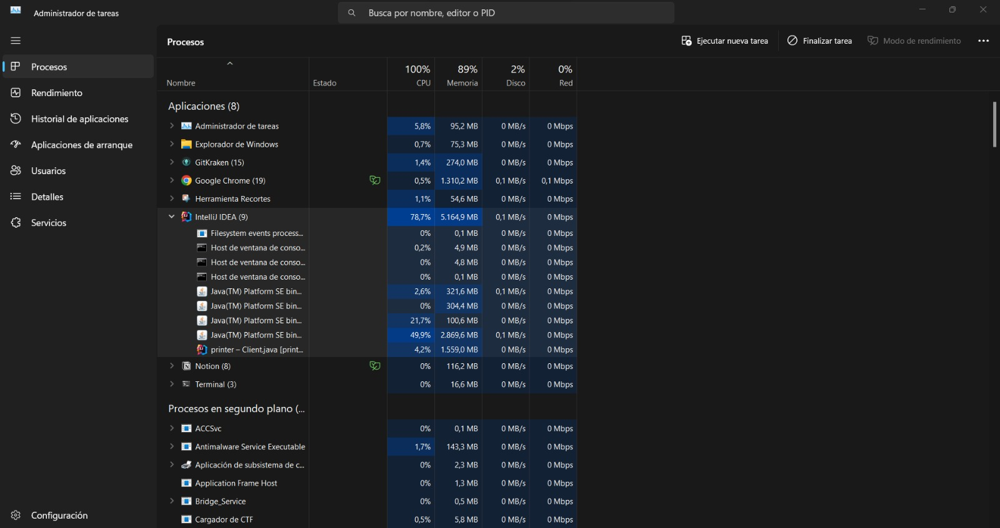
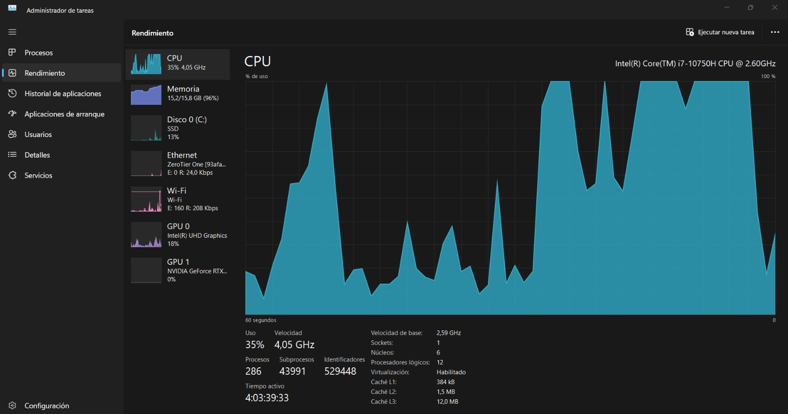

1. **Concurrency Implementation:** In our application, we have implemented the use of multiple threads to respond concurrently to requests from various clients. This concurrency is not just virtual; it's tangible.

   To verify this capability, we turned to the Windows Task Manager. When running the application and generating multiple concurrent requests, a significant increase in CPU usage can be observed. Additionally, we noticed a rise in the number of "threads," indicating that several threads are running simultaneously. Screenshots taken during the tests clearly illustrate this behavior, with multiple instances of "Java(TM) Platform SE bin..." and a peak in the CPU usage graph. These indicators confirm that concurrency in our application is real and effectively managed by the operating system and hardware.

